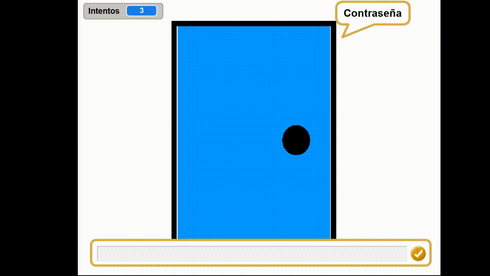
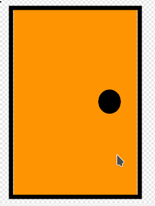
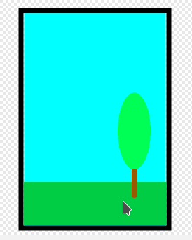
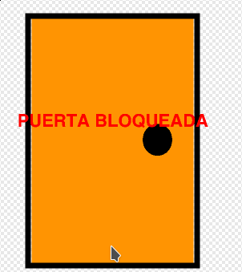
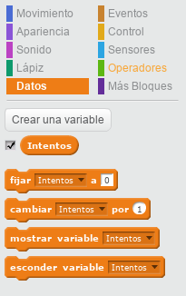
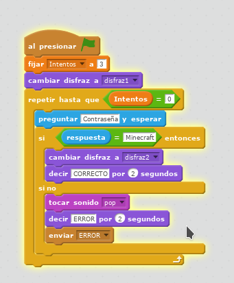
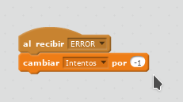
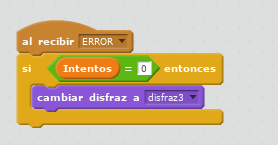

# P1 - Smart Cities - Alarmas

  


 Vamos a automatizar la apertura de nuestra puerta de seguridad. El objetivo es que nuestra puerta demande una contraseña para su apertura, estableciendo un número máximo de intentos \(3\).   
Si aciertas, la puerta se abrirá. Si fallas, se bloqueará


## Pasito a pasito

* En primer lugar vamos a dibujar una puerta con tres disfraces diferentes. La herramienta rectángulo nos va a venir pintiparada :-\) :

| Puerta cerrada | Puerta abierta | Puerta bloqueada |
| :---: | :---: | :---: |
|  |  |  |

* Vamos a trabajar con variables, que es una estructura de datos referenciada por un nombre que puede cambiar de contenido durante la ejecución de un programa. Resumiendo: es como un contenedor de información y que luego nosotros decidiremos cómo mostrar esa información.

En la categoría datos, creamos una variable que vamos a llamar "intentos"  


La variable "intentos" la vamos a usar para contabilizar el número de veces que fallamos con nuestra clave de acceso


* Vamos a programar nuestra puerta siguiendo esta estructura de bloques. Al terminar la programación es momento de entender qué estás programando y cómo funciona.  


¡Observa que en tu caso la clave de acceso puede ser diferente!


* Ahora vamos a configurar los fallos para que nos reste un intento cada vez. Esto lo hacemos creando en la categoría "Eventos" un bloque de "al recibir \[mensaje nuevo\]" y lo llamamos como queramos.  


Siempre que creemos un mensaje es porque en alguna parte de nuestra programación algún elemento va a recibir ese mensaje y a reaccionar al mensaje de alguna forma.   
Fíjate en el punto anterior e intenta localizar el bloque "enviar \[mensaje\]".


* Por último configuramos la última parte de nuestra programación. La que cuando agota todos los intentos nos bloqueará la puerta. Fíjate de qué manera tan sencilla hemos conseguido acabar el juego.                                                                                                    


FASE 1 completada


  

