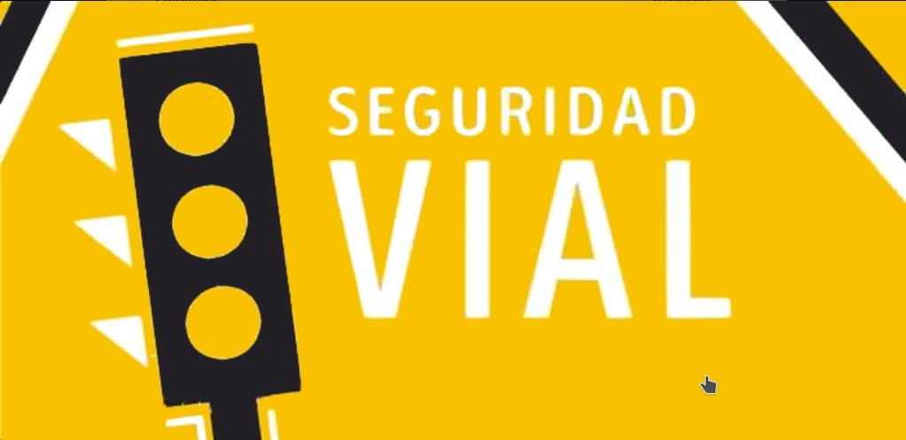
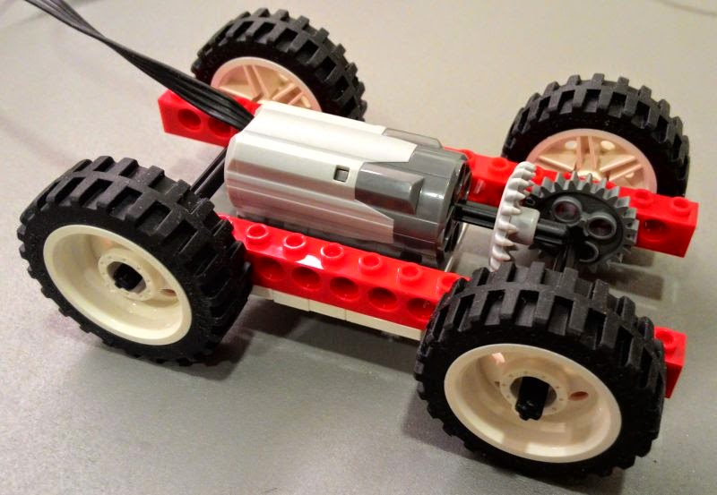
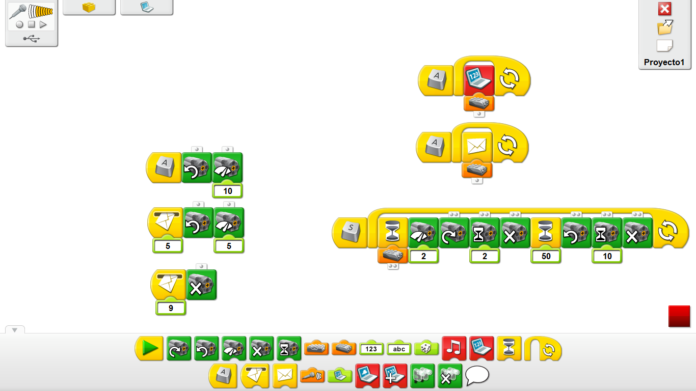

# P3 - Smart Cities - Seguridad Vial

INTRODUCCIÓN:


La Seguridad vial, es la prevención de accidentes de trafico o la minimización de sus efectos para mejorar la vida de las personas y un área de trabajo muy importante para las ciudades de hoy y del futuro.



FASE 1 - RoboGENIN \(+6\) a RoboNINJA \(+8\)



FASE 2 baja al final de página RoboMASTER \(+10\) y RoboCHAMPION \(+12\)


## **RETO 1**

Piensa, programa y construye alguno de los elementos que ayudan a regular el trafico y evitar que sucedan accidentes. a continuación encontraras diversos ejemplos,uno de ellos es un semáforo inteligente que se activa al detectar que los peatones se acercan a el.

1. Trabaja en equipo, llega a un acuerdo con todos tus compañeros y decide que sistema desarrollara cada uno.
2. Crea una programación basada en las siguientes opciones para WeDo, Scratch y/o Lego Mindstorm
3. Construye lo necesario para realizar tu modelo.
4. Comparte con tus compañeros, y juntad todos vuestro proyectos.

TU MODELO TIENE QUE TENER:

* [ ] Motor\(es\) \[x2 uno para el coche y otro para la barrera\]
* [ ] Sensor de distancia \(infrarrojos/ultrasonidos\) \[x2 uno para el coche y otro para la barrera\]
* [ ] Ciudad hecha con piezas de Lego
* [ ] Barrera que suba o baje en función del tráfico
* [ ] Programación acorde a tus necesidades

## Programación WeDo


FASE 1 COMPLETADA



FASE 2 - RoboMASTER \(+10\) y RoboCHAMPION \(+12\)


##  

