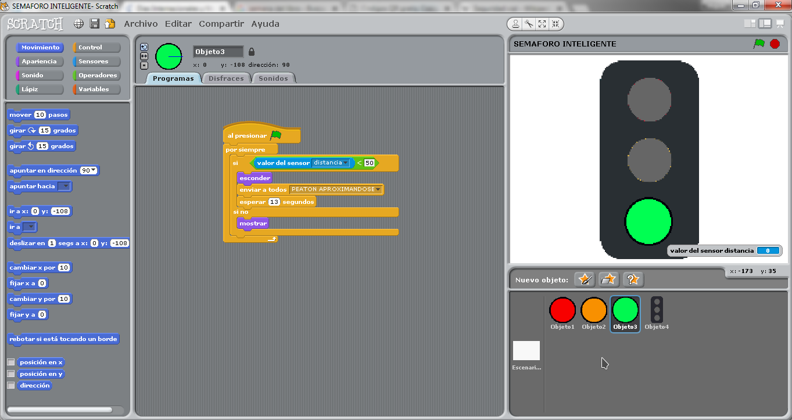
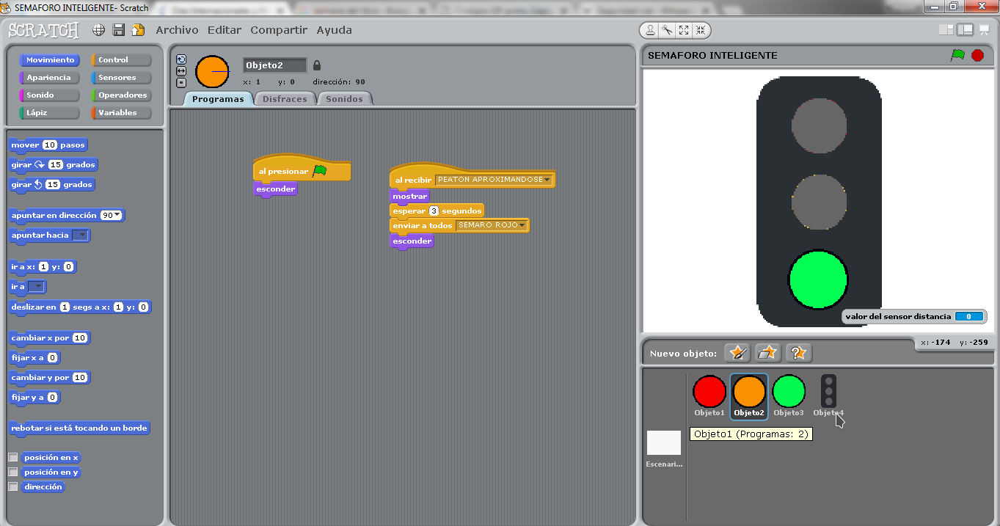
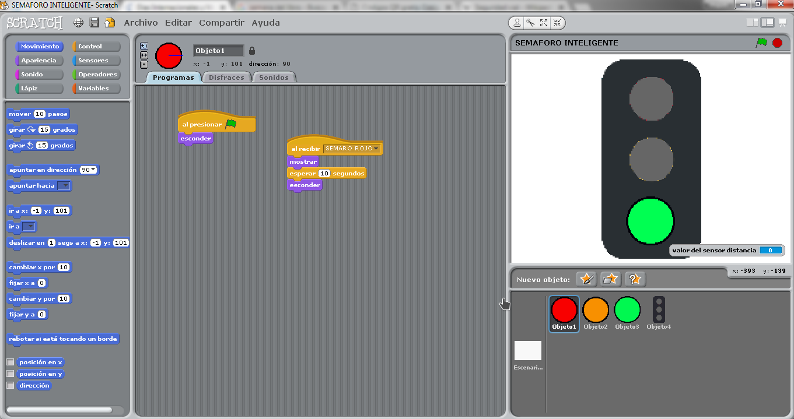
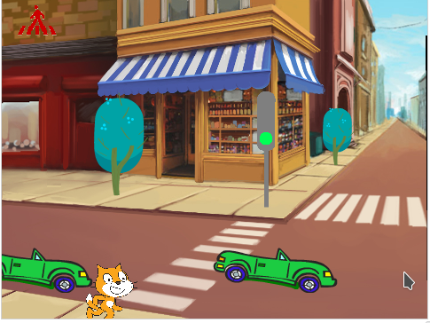
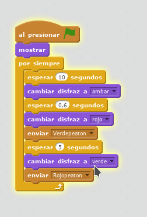
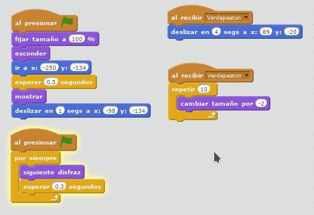
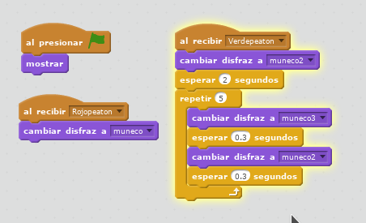
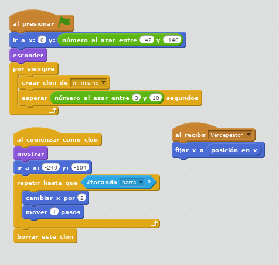

# P4 - Smart Cities - Seguridad Vial \#2


La semana pasada estuviste trabajando en un proyecto de Seguridad Vial \(Road Safety\) hecho con WeDo en el que hiciste un montaje y una programación. 

Esta semana nos toca Scratch, y para ello programaremos un semáforo inteligente que se activa al detectar que los peatones se acercan a el..



FASE 1 - RoboGENIN \(+6\) a RoboNINJA \(+8\)



FASE 2 baja al final de página RoboMASTER \(+10\) y RoboCHAMPION \(+12\)


## **RETO**

1. **EN EQUIPO: DISEÑA** y **PROGRAMA** siguiendo en todo momento la programación Scratch que aparece en las imágenes que verás en las pestañas de más abajo.
2. **CONSTRUYE** **con LEGO:**
   * **Un semáforo**
   * **Un pequeño coche sin motor**
   * **Una calle con un paso de peatones**
3. **MATERIALES** **NECESARIOS** **PARA** **ESTA** **ACTIVIDAD:**

* [ ] **Piezas de LEGO**
* [ ] **Motor WeDo** 
* [ ] **Sensor distancia**
* [ ] **Scratch 1.4 ó 2.0 \(online\)**

REPARTO DE TAREAS DENTRO DEL EQUIPO:

1. Experto/a en montaje
2. Experto/a en programación

_**RECUERDA SIEMPRE:**  
Trabaja en equipo, llega a un acuerdo con todos tus compañeros y decide que sistema desarrollará cada uno._

**PROGRAMACIÓN SCRATCH:**
























FIN FASE 1 RoboGENIN \(+6\) a RoboNINJA \(+8\)



FASE 2 RoboMASTER \(+10\) y RoboCHAMPION \(+12\)


## ¿PODRÍAS COMPLETAR LOS SIGUIENTES RETOS ADICIONALES DE DISEÑO?

* [ ] Un escenario completo
* [ ] Semáforo para vehículos
* [ ] Semáforo para peatones
* [ ] Un peatón
* [ ] Coches

## ¿PODRÍAS COMPLETAR LOS SIGUIENTES RETOS ADICIONALES DE PROGRAMACIÓN?

**PROGRAMACIÓN SCRATCH:**




















FIN FASE 2 RoboMASTER \(+10\) y RoboCHAMPION \(+12\)


##  

## \*\*\*\*

