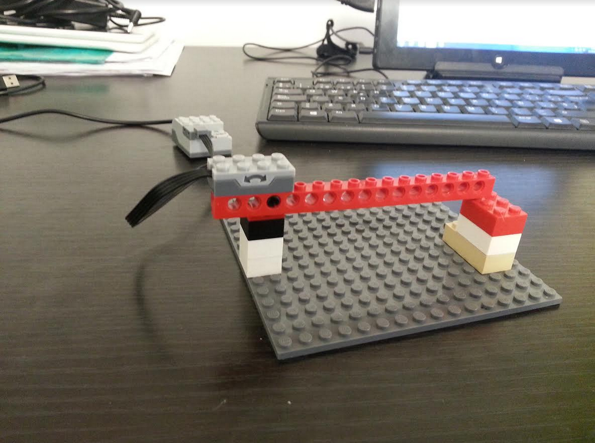
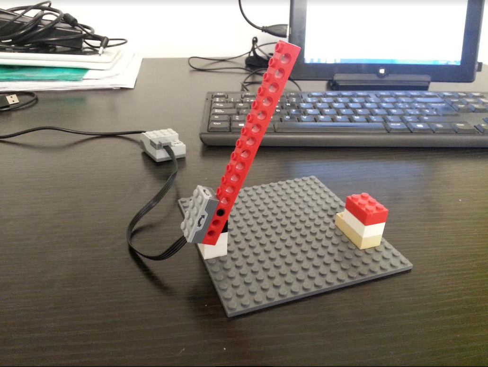

# P5 - Smart Cities - Parking inteligente


La semana pasada trabajamos con seguridad vial.

Esta semana haremos una programación inteligente de acceso a un parking, que contabilizará el número total de plazas y las disponibles en función de un sensor de inclinación que irá contando el número de veces que sube y baja la valla.

¡VAMOS ALLÁ!



FASE 1 - RoboGENIN \(+6\) a RoboNINJA \(+8\)



FASE 2 baja al final de página RoboMASTER \(+10\) y RoboCHAMPION \(+12\)


## **RETO** 

1. **EN EQUIPO: DISEÑA** y **PROGRAMA** siguiendo en todo momento la programación Scratch que aparece en las imágenes que verás en las pestañas de más abajo.
2. **CONSTRUYE** **con LEGO:**

* **Una barrera sencilla a la que le añadirás un motor y un sensor como en la foto**

\*\*\*\*

* **MATERIALES** **NECESARIOS** **PARA** **ESTA** **ACTIVIDAD:**
* **Piezas de LEGO**
* **Motor WeDo**
* **Sensor distancia**
* **Scratch 1.4 ó 2.0 \(online\)**

REPARTO DE TAREAS DENTRO DEL EQUIPO:

1. Experto/a en montaje
2. Experto/a en programación

_**RECUERDA SIEMPRE:**_ _Trabaja en equipo, llega a un acuerdo con todos tus compañeros y decide que sistema desarrollará cada uno._

**MONTAJE LEGO:**











  
**PROGRAMACIÓN SCRATCH:**  












FIN FASE 1 RoboGENIN \(+6\) a RoboNINJA \(+8\)



FASE 2 RoboMASTER \(+10\) y RoboCHAMPION \(+12\)


## **¿PODRÍAS COMPLETAR LOS SIGUIENTES RETOS ADICIONALES DE DISEÑO?**

## ¿PODRÍAS COMPLETAR LOS SIGUIENTES RETOS ADICIONALES DE PROGRAMACIÓN?


FIN FASE 2 RoboMASTER \(+10\) y RoboCHAMPION \(+12\)


