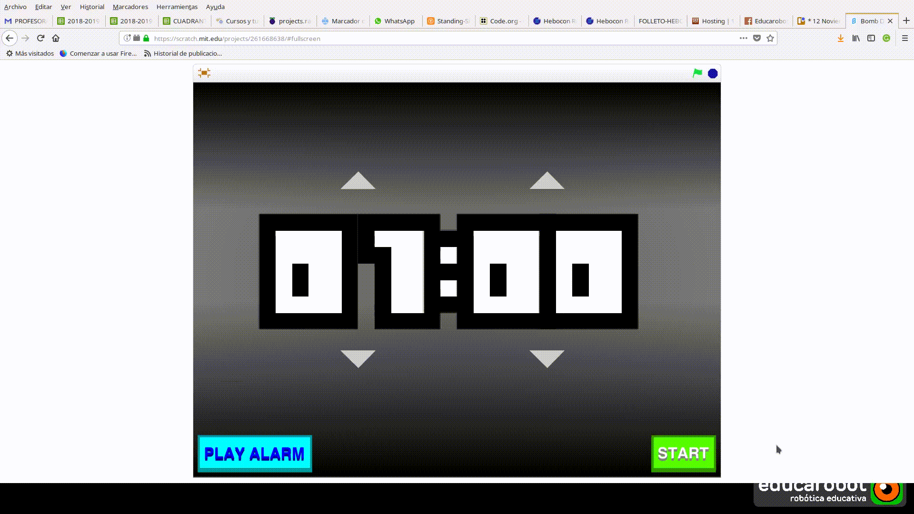
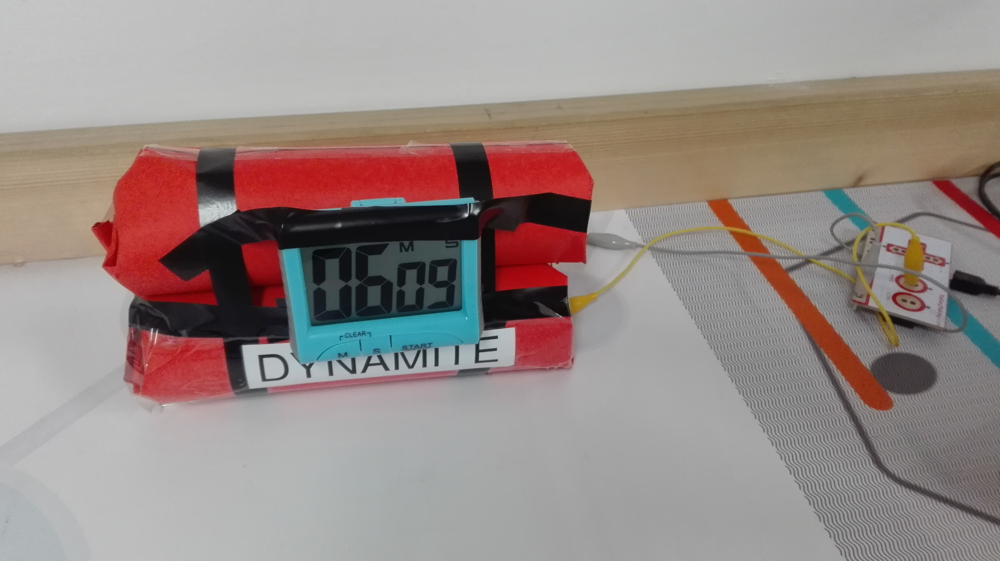

# P7 - Bomb Defusal - Desactivando bombas


BOMB Defusal - Desactivando bombas

Esta semana vamos a ver cómo funcionáis como artificieros o **Técnico Especialista en Desactivación de Artefactos Explosivos \(TEDAX\)** 

El objetivo es muy sencillo:  
**DESACTIVAR LA BOMBA EN EL MENOR TIEMPO POSIBLE**

¡VAMOS ALLÁ!



FASE 1 - RoboGENIN \(+6\) a RoboNINJA

Haz clic [aquí](https://scratch.mit.edu/projects/261668638/) para ver la programación en Scratch. Esta semana NO necesitas trabajar con ella, pero estaría bien si le echas un vistazo.


## RETO 

Monta y programa tu robot para que sea capaz de retirar, desactivar y llevar a una zona de control la dinamita que encontrarás encima de la mesa de competición. 

¿PUEDES HACERLO EN EL MENOR TIEMPO POSIBLE? LA BOMBA _**SE ACTIVARÁ AL COGERLA**_, TIENES QUE LLEVARLA RÁPIDO A LA _**ZONA DE DESACTIVACIÓN**_.

Al coger la dinamita dispondrás de SÓLO 1 minuto para trasladarla a la zona segura.











## MATERIALES NECESARIOS PARA ESTA ACTIVIDAD: 

1. Piezas Lego Technic; NXT/EV3 
2. Sofware NXT/EV3
3. Ordenadores.

REPARTO DE TAREAS DENTRO DEL EQUIPO \(HOY LOS EQUIPOS PUEDEN SER MÁXIMO DE 2 INTEGRANTES\).

1. Expertos/as en montaje
2. Expertos/as en programación

